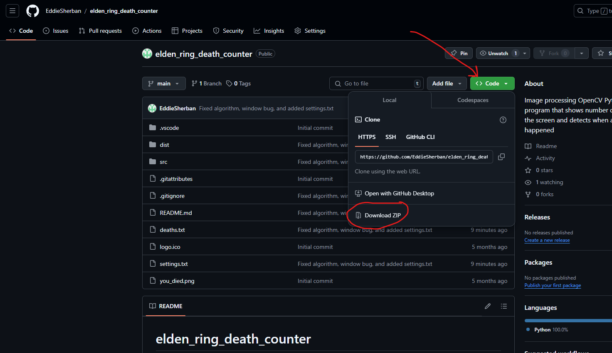

# elden_ring_death_counter
 Image processing OpenCV Python program that automatically detects and shows number of deaths on the screen

**NOTE: Game should be in borderless window**  

 # Download and Setup

 ## Step 1: Download the Files

 ## Step 2:
  Extract the folder to desired location  

 ## Step 3:
 Open the "dist" folder

 ## Step 4:
 If you want, adjust "deaths.txt" and "settings.txt" and save the file, then run "death_counter_app.exe"

 ## Step 5:
 Play Elden Ring and the app will count your deaths for you

 ## Step 6:
 EXIT THE PROGRAM by ctrl + left-click the "Deaths: " text

 # Note on Operating Systems
   Currently only tested on my windows computer, not sure if works with other operating systems.

# Updates: Nov 21, 2024
  • Fixed the unclickable window bug. Now the windows from which you clicked should be clickable.  
  • Improved the algorithm so that it processes the template image once at the beginning of the program instead of every screenshot.  
  • Added "settings.txt" which can be edited. Currently only have "Deaths:" font size.  
  
  # Updates: Jan 18, 2025
  • Added adjustable fonts for "Deaths: " text, as well as different colors.
